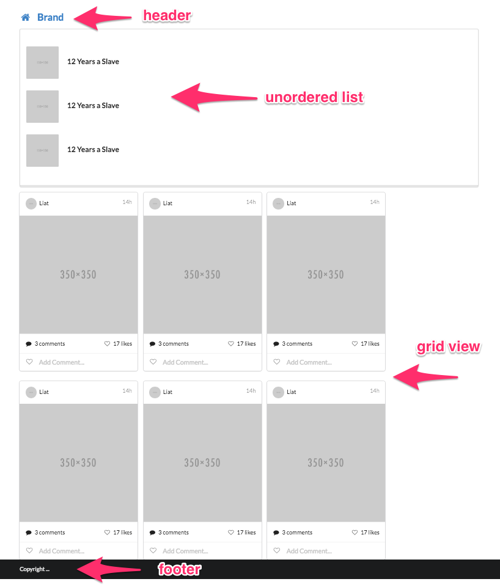

# CTools plugins

Our working method is to build a static site with jekyll and then make it dynamic, by copying HTML and CSS to the Drupal site, and replacing the static parts with dynamic content. You can read more about this method in [Gizra blog](http://www.gizra.com/content/custom-css-as-contrib-with-jekyll/).

In this training we will focus on a particular part of the implementation of this method, by using two powerful drupal’s modules: [CTools](https://www.drupal.org/project/ctools) and [Panels](https://www.drupal.org/project/panels).

One of the great tools of CTools is the Plugins.
CTools plugin is a piece of code located in small file (.inc), which help us to extend any module functionality.
Panels provides content areas exposed as block or page. We use the panel as a container to display our plugin.
In this post we'll go through a few steps, show how to create and use CTools plugins with Panels.


### 1 - Recognize the plugin in the Markup

First we need to look at the Markup and recognize the piece of code that we going to make a plugin for.
For example, look at this page:



We can identify three parts: **header**, **footer** and **content**. The content area contains two items lists: one is a list view and the second is a grid view. Header and footer repeat on every page, so they will be part of our layout. Every item in the list is a piece of code that repeat itself, so we can look at one list as a plugin. In this page we have two lists, so we will create separate plugin for each list.

The final code for the examples below can be found in [this repository](https://github.com/Gizra/dynamic_example/tree/lesson1).

Let’s look at the code in the static site. 
Go to */static/src/hello-world/index.html* and open the file.

```
---
layout: default
label: Hello-world
---

<div class="ui segment stacked">
  <div class="ui very relaxed items">

    
    
    


  </div>
</div>

<div class="ui link cards">


  
  
  
  
  
  
  
</div>
```


