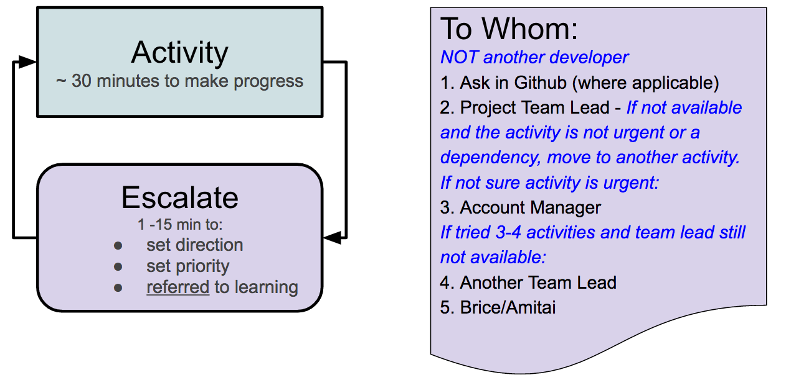

# Escalation and Timeboxing

The Goal of this chapter is to clarify Gizra’s core project management processes.

## Activity Process

### 1. Create weekly plan

On Thursday Account Manager create weekly plan and Team Lead assigns the tasks to the developers. Every Developer gets his/her tasks for the next week.  
Note: priority is indicated by how high up the task is on the list.  
Exception: QA has it’s own board and it works on an ongoing list - not a weekly plan.

### 2. Go over the tasks

On Sunday Developer goes over all his/her tasks and do the following:
1. **Make sure you understand the task**. Ask question until you do.
2. **Check time boxing**. If it doesn’t make sense to you, communicate that to your team lead. 
3. **Write user stories** (where applicable) **and outline solution** (title in Github ## Solution Outline). If you are not sure about the solution, tag your team lead to review it.

Team lead gives goes over the outline solutions and give input if necessary.

### 3. Write code

The rest of the week:
Developers write code and fix bugs as needed.  
Read [How to submit a PR].  
Team leads review and give direction to solve problems.

| Activity Type | Activity is clear | Prep | Plan | Implement |
| -- | -- | -- | -- | -- |
| Task | Understand the issue?* | Check timeboxing.* | Write user stories and outline solution.* | Write code and Review (again and again and again!!!). |
| Bug | Expected vs actual? | Reproduce bug. | List affecting areas with strategies & priority. | Implement strategies. |

*Weekly Prep (1st day of week)

## Escalation Process

## Time Boxing

1. Timeboxing is the **amount of time set to complete a task**.
2. It is a tool to provide a price proposal to the clients and manage our project resources.
3. Timeboxing is based on an **average** skilled developer (NOT according to who will be doing the task).
4. Each developer has a **personal factor** ( x * timebox) of how much time they take to complete a task per the timebox.
  * Each developer knows their own number.
  * It’s an overall average usually based on at least 6 months of development. 
  * It’s dependent on ramp-up requirements per project (you may be a skilled developer but you now have a project of with a technology that is new to you).

5. **Escalation in timebox** - Every developer works a little different.  Decide at what points of the timebox, you stop and check where you are (use personal factor to help here). Work with Team Lead to create a structure that works for you.
6. **Timeboxing factor** (actual time vs. set timebox) is a nonspecific indicator. It is used to raise red flags in areas that need attention - many of the them are not related to the developers capabilities. Issues can be:
  * Is the timebox assessment to the client wrong?
  * The task may not make sense.
  * Is the task clear - explained well and understood well?
  * Where is a developer struggling and if we can support with training?
  * Where as a company can we do better?

## Report in Productivity

1. Be accurate in reporting! We need real numbers to help us as a company do our best. It's not about nit picking with employees.
2. Update every day. This is important for our reporting with the clients.
3. Expectations: 9 hour days, we expect to see 6-8 hours of productive time. Yes, take breaks as needed but when you work, work well!
4. Non-project reporting:
  * **IT issues** - Install issues are taken into consideration.
  * **Training** - Sessions and practice.
  * **Gizra Meetings** - Company wide meetings and personal meetings with operations manager.
  * **Business Development** -  It includes any work on gizra.com, Blog post, marketing and RFP materials.
5. Installments and set-ups - report inside the project with label “Installation and set-up”.

## Team Leads

### Task process 

know the task process, monitor it, and clear away as many obstacles as possible - Sundays are a critical days. Review the outline solutions wrote by the developers, and give your input if necessary.

### Escalation process

understand the escalation process and enforce it - this also means what should not be done, like a developer escalating to another developer. When a developer escalates to you, your responsibility is to provide a direction, priorities where applicable, and training resources if needed.   
Keep to the 1-15 minute timebox. If it takes longer, then you are probably doing something you shouldn’t (like training them or trying to solve the bug with them). Your example of taking timeboxing seriously will trickle down to the developers.

### Training

make note of the areas where the developers need training help and communicate this to Employee training and development person, so she can provide the appropriate resources. It may be personally training the developer(s), finding the best online training, or matching up a mentor.

### Feedback

your interaction with the developers is very important.  When a developer does something right, remember to provide them positive feedback - they really need to hear it.  When the developer messes up, tell them - getting real time feedback to where they need to improve is helpful for them and for Gizra. If you see that you need to correct/remind a developer repeatedly on the same mistake, it's time for you to escalate this at your next meeting with Brice/Amitai.

