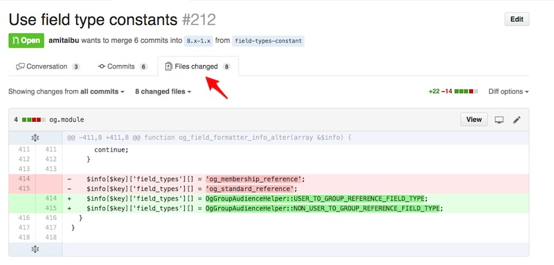

# Pull Requests

## Submitting Pull Requests

A Pull Request (PR) is the way of letting the team lead to know new code is in the making or ready for their review.

### Work in progress

As soon as you start a new branch, and add new code we should commit and push it, as means of having backup to your code. In case your computer will  break, no work will be lost.

1. Open a pull request with a clear title prefixed with WIP (Work in progress). For example: `WIP: Add the body field in the admin content view`
2. In the body if the pull request add a reference to the original issue. For example, if the issue is under `https://github.com/Gizra/foo/issues/100` then enter `#100` in the description (it will automatically be converted to a link)

It is considered a best practice to update the issue from time to time (about once an hour) with your progress. It can be a screenshot or a one-liner; just enough for the rest of the team to keep in tabs with your progress.

Mistakes are avoided by doing so. A screenshot can help detect early on, cases  where you are working on the wrong element, or another developers is already working on a similar task.

### Ready for review

A pull request is ready for review whenever you feel it's ready for a review by the team lead, and is ready to be merged into the `master` branch.

The rule of thumb of changing a PR to ready for review is that you need to be sure the PR has the required changes. Not more not less. To do so, follow these steps:

1. Review your own work, by checking the `Files changes` tab 
2. Every change on every file and every character should be a change you can explain and desire. This part is crucial as newbies may often commit unrelated code changes. If such unrelated code was committed, it should be removed.
3. Attach final screenshots and/ or explanation needed for the team lead to quickly understand what the PR is doing.
4. Remove the `WIP` prefix from the title
5. Add the `ready for review` label 
