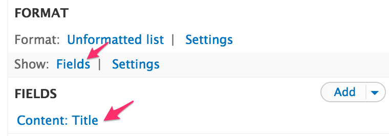

# Views

Simply, Views module is a query builder. But it is not simple at all, In fact, Views is a very powerful and complex tool, have a lot of options that sometimes can be very confusing. But don’t you worry, when you understand the basic logical, it becomes more easy to dive into it.

As a query builder, behind it there is a SQL query. For these who want to watch the query in the UI, during building the view, go to `admin/structure/views/settings` and check the `Show the SQL query` option.

In this training we will create a view that display list of blog titles.

I created content type called `Blog` with basic fields: Title and Body, and generate some demo content.

To start build new View, go to `admin/structure/views/add`.

This form give us some main View definitions. Set the View name and description (be kind and describe it shortly and clearly, so others can understand what this View shows), then, in ‘show’ field define what kind of information the View will show. This selection determine the main table in DB that the View will use to retrieve data and it cannot be changed later.

In this View we want to display list of blog’s titles, so we select to show `Content` (nodes). Since we chose Content, we get also the option to select which content type. Although we know we need to choose the `Blog` content type, let’s leave it `All` for now, because I want to show you how to define that filter in the edit View page.

There is also the possibility to create a page and a block in this form. Our Blog list will display on a page, but we will create it at the next step (just for you to see how we define this in the View edit page.), So leave the page checkboxes unchecked.
We finished here, click `Continue and edit` button.

Now we are in the View edit page. Be aware that the View not saved until you click on the `Save` button, so I recommend to click it right now and also during working on the view.

## Displays

Any View can contain multiple displays of different types (page, block, feed etc). Some contributed modules extend the displays options. That allows us  to create a single View that displays the same content in multiple ways, using different formats, filters etc. For example, we can create View that shows list of blog post. In the `page display` we will show all the nodes with their title and teaser, and in the `block display` we will show only the titles of the last five posts.

In this training we want to display page with list of blog titles, so click on the `Add` button in the displays section (near the `Master`) and select `Page`. Now you can see we have two displays: `Master` and `Page` (if you can't see the Master display, go to and check the `Always show the master display` option).

Every web page needs to have a path, so click on the `No path is set` and specify the URL. Under this _Page setting_ section you can also link the page to a menu and define an access rule for the page.
Next, click on `None` under the _Title_ section and specify the page title, like Blog.

As you can see, when you fill the title name. you get the choice to applied it **All displays** or only **This page**. This choice come up almost in every change you want to make in the View.  The default selection is All displays, So be careful when you have multiple displays. Always make sure you make changes to the displays you want to make changes to.

## Format

Under the _Format_ section we can define how the View will display. Let's stick with the default one: `unformatted list`.

Then, we can specify which parts of the content will display. We need to choose between `fields` or `content`.

When you choose `fields`, it means that you can choose which fields from the content type the View will display. In our case we want to display the post title, so under _Format_ we will select to show `Fields`, and under _Fields_ section we will add the `Content: Title`  which is the node title field.

Another option is to show `Content`.

Although we won't choose this in our case (because we want to display only the node title field), I will explain this option because it is an opportunity to explain the Drupal view modes.

